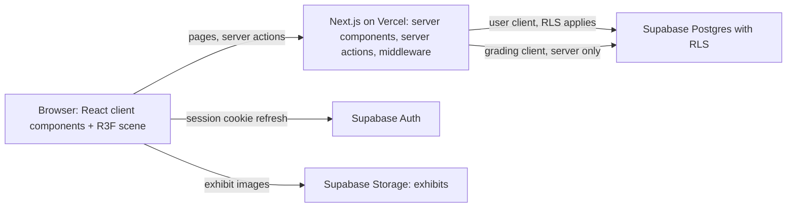
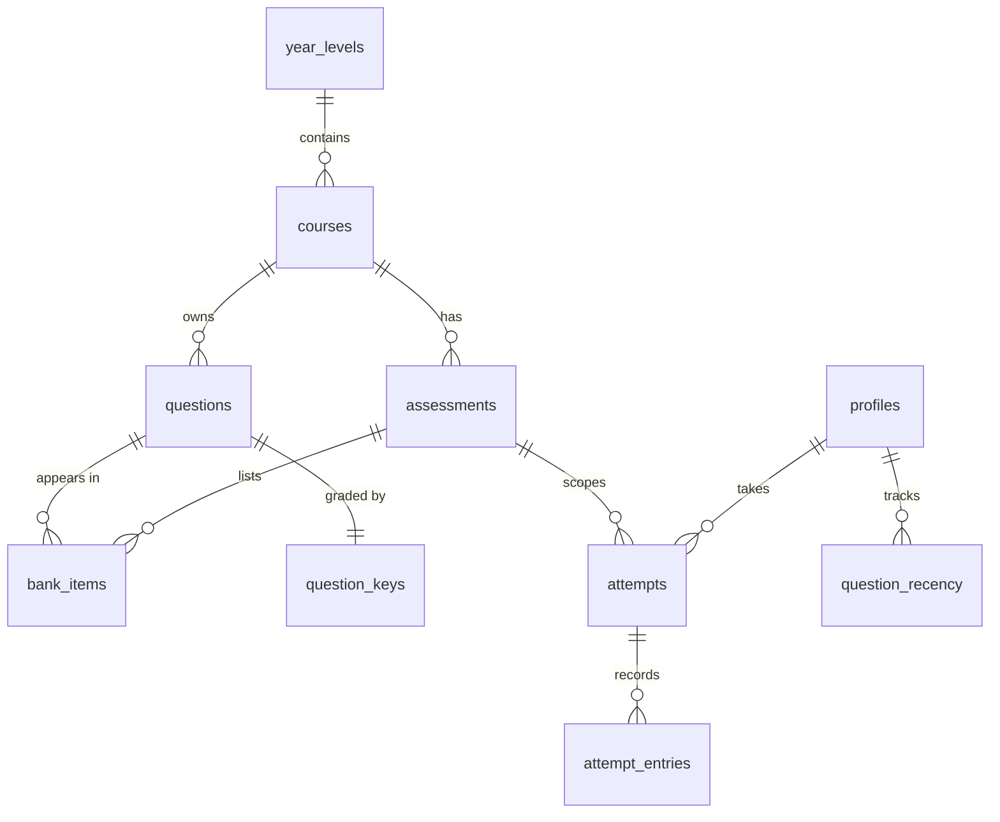
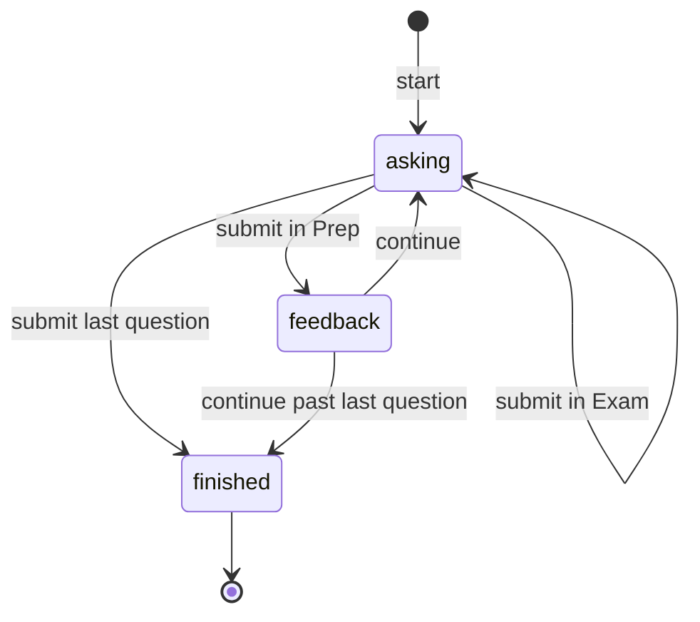
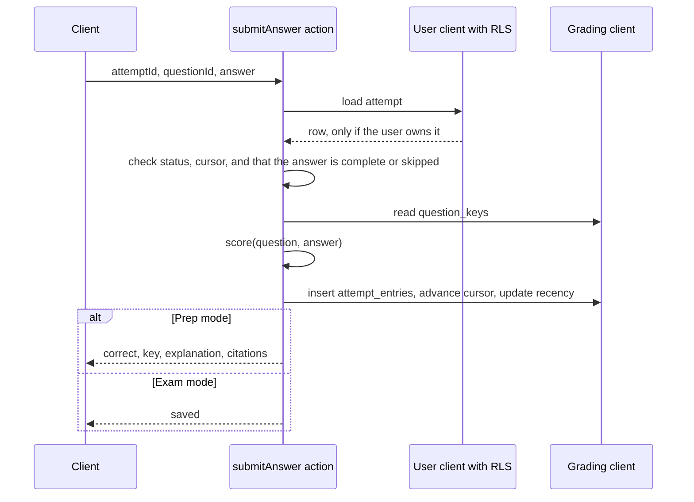
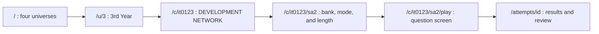

# Revwi architecture

Revwi is a review webapp for course assessments. Admins add courses and manage a question bank for each assessment. Students sign in, pick their year level, pick a course, and review one assessment bank at a time in Prep or Exam mode.

The interface treats each year level as a universe and each course as a planet. Students move between them in a Three.js scene. The question screen itself is a flat reading surface.

This document describes the target system. The code in `src/` today is the earlier Vite app, DevNet Reviewer. The rebrand plan moves that code into the layout below phase by phase.

## Starting content

Revwi launches with one course in one universe.

- The universe is **3rd Year**. The 1st, 2nd, and 4th Year universes exist and show as empty.
- The planet is `IT0123` **DEVELOPMENT NETWORK**, also called Networking and Communications 2.
- The course has five assessments: SA1, SA2, SA3, Midterm Exam, and Final Exam.
- The 122 curated questions in `src/questions.ts` seed the SA2 and Midterm Exam banks. SA1, SA3, and Final Exam start empty, and the planet shows them as locked.

## System overview



The stack has five parts.

- Next.js with the App Router and TypeScript renders pages and runs every write as a server action.
- Supabase Auth issues the session. `@supabase/ssr` stores it in cookies so server components and middleware can read it.
- Supabase Postgres holds all shared data. Row-level security (RLS) decides who reads and writes each row.
- Supabase Storage holds exhibit images. Music and sound effects stay in `public/` because every user gets the same files.
- `@react-three/fiber` and `@react-three/drei` render the universe and planet scenes on the client.

## Domain model

The schema follows the way students move through the app: year level, then course, then assessment, then attempt.



### Year levels and courses

`year_levels` has one row per universe, with `ordinal` from 1 to 4 and a display `name`. Empty universes are real rows, so the multiverse always shows four.

`courses` holds `year_level_id`, `code` (`IT0123`), `title`, `alias`, `slug`, and `planet`. The `planet` column is jsonb that describes how the planet looks: palette, surface noise seed, ring, and atmosphere. The client parses it with a Zod schema before it reaches the scene. A new course needs no new art assets.

### Assessments

`assessments` holds `course_id`, `kind`, `number`, `label`, `ordinal`, `slug`, and `modules`. In TypeScript the kind is a discriminated union.

```ts
type AssessmentKind =
	| { kind: 'summative'; number: number }
	| { kind: 'major'; exam: 'midterm' | 'final' }
```

A SQL check constraint enforces the same rule. A summative row must have a `number` and no `exam`. A major row must have an `exam` and no `number`. `ordinal` sets the order on the planet, which is SA1, SA2, Midterm Exam, SA3, Final Exam for `IT0123`.

### Questions and banks

`questions` keeps the union from `src/questions.ts`. A question is `single`, `multiple`, or `matching`, and it carries `module`, `topic`, `prompt`, choices or pairs, `citations`, and an optional exhibit path. Each question belongs to one course.

A question also has a `status` of `draft`, `verified`, or `published`. Students see published questions only. An admin can publish a question only after it has a key, an explanation, and at least one citation. The database enforces that rule with a trigger, so the admin console cannot skip it.

`bank_items(assessment_id, question_id, source_number)` places a question in an assessment bank. The curation step merged questions that appeared in both the Midterm and SA2 exports. A merged question stays one row and gets two `bank_items`, so its recency and history are shared across both banks.

`question_keys(question_id, correct, explanation)` holds the answer and the explanation in a separate table. RLS gives students no access to this table.

### Attempts

An attempt is a state machine. One row in `attempts` covers both the active session and the finished result, so there is no second table to keep in sync.



`attempts` holds `user_id`, `assessment_id`, `mode` (`prep` or `exam`), `status`, `question_ids` (the fixed order), `cursor`, `draft`, `retry_of`, `started_at`, `finished_at`, `score`, and `best_streak`. A partial unique index allows one unfinished attempt per student per assessment. Resume reads this row, so the order and the locked answers survive a reload or a change of device.

`attempt_entries(attempt_id, question_id, answer, skipped, correct)` records each submitted answer. Only the grading code writes this table.

`question_recency(user_id, question_id, seen_count, last_seen_at)` feeds `buildQuestionOrder`, which picks unseen questions first and then the least recently seen.

Audio and music preferences stay in `localStorage`. They belong to the device, not to the account.

## Roles and access

`profiles(user_id, role)` gives each user the role `admin` or `student`. New sign-ups get `student`. The first admin is set with SQL. After that, admins promote other users from the admin console.

RLS enforces these rules. The Next.js middleware also redirects students away from `/admin`, but the middleware is a convenience. The database is the boundary.

| Table | Student | Admin |
| --- | --- | --- |
| `year_levels`, `courses`, `assessments` | Read | Read and write |
| `questions`, `bank_items` | Read published rows | Read and write |
| `question_keys` | No access | Read and write |
| `attempts` | Read own rows | Read all rows |
| `attempt_entries` | Read own rows, with the Exam rule below | Read all rows |
| `question_recency` | Read own rows | Read all rows |
| `profiles` | Read own row | Read and write |

Students cannot insert or update `attempts`, `attempt_entries`, or `question_recency` directly. Server actions do those writes after they check the user.

The Exam rule keeps answers private during an exam. A student can read an entry only when its attempt is in Prep mode or has the status `finished`. Without this rule, a student could query the `correct` column in the middle of an Exam attempt.

## Grading

Grading runs in server actions, not in the browser and not in Postgres functions. The server actions call the pure `score()` function that already exists in `src/quiz.ts`, so the app has one implementation of the scoring rules.



The grading client uses the Supabase service role key. It lives in `lib/server/grading.ts`, which imports `server-only`, so a build fails if client code imports it. No other module creates a service role client.

`finishAttempt` sets `status` to `finished` and stores `score` and `best_streak`. After that, the results page reads the entries and keys through the student's own RLS access.

## Navigation and the 3D scene



The `(space)` route group layout mounts one R3F `Canvas`. The canvas stays mounted while the route changes between the multiverse, a universe, and a planet. The route segment sets a camera target, and the camera flies to the target instead of reloading a scene. The canvas loads through `next/dynamic` with `ssr: false`.

Each page in the group also renders a plain HTML list of the same links, such as the universes, the planets, or the assessments, over the canvas. The canvas has `aria-hidden`. Keyboard users, screen-reader users, and search crawlers use the HTML list. Clicks on a 3D object call the same `router.push` as the list link.

When the browser reports `prefers-reduced-motion`, the camera cuts to the target with a crossfade and planets stop rotating. On the question screen the scene switches to `frameloop="demand"` and dims behind the reading surface. The quiz renders no 3D content.

The Phase 0 prototype sets the frame-time budget for a 390 px phone viewport. The scene must meet that budget before it ships.

## Directory layout

```text
app/
	(auth)/sign-in/page.tsx
	(space)/layout.tsx              persistent Canvas and HTML nav mirror
	(space)/page.tsx                multiverse
	(space)/u/[year]/page.tsx       universe
	(space)/c/[course]/page.tsx     planet
	(space)/c/[course]/[assessment]/page.tsx
	(play)/c/[course]/[assessment]/play/page.tsx
	(play)/attempts/[id]/page.tsx   results and review
	admin/                          courses, assessments, questions, users
	actions/                        attempts.ts, admin.ts
middleware.ts                     session refresh and admin redirect
lib/
	domain/                         pure TypeScript with no framework imports
	supabase/                       server.ts, browser.ts, middleware.ts, types.ts
	server/grading.ts               service role client, server only
components/
	space/                          R3F scenes, Planet, Universe, CameraRig
	quiz/                           ported from src/ui.tsx and src/App.tsx
	admin/
	audio/                          ported from src/audio*.ts and src/music.ts
supabase/
	migrations/                     schema, RLS, triggers
	seed.ts                         loads the current bank
public/                           music, sfx
```

`lib/domain` holds the logic that Revwi keeps from DevNet Reviewer. It has no React, Next.js, or Supabase imports, so Vitest tests it directly.

| Current file | New location |
| --- | --- |
| `src/quiz.ts` scoring, order, and streak functions | `lib/domain/quiz.ts` |
| `src/quiz.ts` persistence and v1 migration | Deleted. Attempts live in Postgres. |
| `src/questions.ts`, `src/curation.ts` | Input to `supabase/seed.ts`, then removed from the bundle |
| `src/App.tsx`, `src/ui.tsx`, `src/lobby.tsx` | `components/quiz/` |
| `src/audio.ts`, `src/audio-bus.ts`, `src/music.ts` | `components/audio/` |
| `scripts/validate-bank.ts` | Checks inside `supabase/seed.ts` |
| `scripts/verify_mvp.py` | Playwright tests under `e2e/` |
| `public/exhibits/` | Supabase Storage bucket `exhibits` |

## Validation at the edges

The app validates data where it crosses a boundary and trusts typed data inside.

- Server actions parse their input with Zod before they touch the database.
- `supabase gen types typescript` writes `lib/supabase/types.ts` from the schema. A column rename fails `tsc`.
- The client parses `courses.planet` with Zod before the scene uses it. A malformed row renders a default planet and logs the course id.
- Admin forms share their Zod schemas with the matching server actions.

## Content workflow

The seed script loads the current bank. It creates the four year levels, the `IT0123` course, the five assessments, 122 questions with keys, and the `bank_items` that link them. It fails if the counts do not match the curation inventory in `src/curation.ts`.

After launch, admins write and edit questions in the admin console. A new question starts as `draft`, and the publish trigger described above gates it.

An importer for LMS HTML exports, such as the files in `mods/`, is a later addition. Those exports show past responses, not trustworthy keys. Imported questions will therefore always land as `draft`.

## Testing

- Vitest covers `lib/domain`. The cases come from the current behavior: exact-set scoring, matching, skip handling, streaks, and question order.
- RLS tests run against the local Supabase stack from `supabase start`. They sign in as a student and as an admin and assert which reads and writes succeed. The Exam rule gets its own case.
- Playwright covers the full student path and the admin path at desktop width and at 390 px, with reduced motion both on and off.

## Deployment

Vercel hosts the Next.js app. Supabase Cloud hosts Auth, Postgres, and Storage. Migrations run with `supabase db push`.

The app reads three environment variables.

- `NEXT_PUBLIC_SUPABASE_URL`
- `NEXT_PUBLIC_SUPABASE_ANON_KEY`
- `SUPABASE_SERVICE_ROLE_KEY`, which only `lib/server/grading.ts` reads

## Design decisions

**Grading in server actions, not Postgres functions.** A Postgres function would keep the service role key out of Next.js. It would also need a second copy of the scoring rules in PL/pgSQL. Revwi keeps one TypeScript `score()` and confines the service role client to one server-only module.

**One attempts table with a status column.** The Vite app kept an active session and a list of finished attempts as two shapes. With a server, one row that moves from `asking` to `finished` is simpler. A unique index replaces the "one unfinished session" check.

**Answer keys in their own table.** Postgres RLS works on rows, not columns. A separate `question_keys` table lets RLS deny every student read without column-level grants.

**One persistent canvas.** Mounting a canvas per page would reload the scene and break the camera flight between universe and planet. The layout keeps the canvas mounted and the routes move the camera.

**3D for navigation only.** The question screen carries long technical prompts and code. It keeps the contrast and type rules in `DESIGN.md`, and the scene stays behind it.

## Open questions

- Which sign-in methods students use: email and password, magic link, or Google with a school domain.
- Whether anyone can sign up, or whether admins invite students.
- Which planet metaphor ships. The Phase 0 concepts compare moons in orbit, landmarks on the surface, and segments of a ring.
